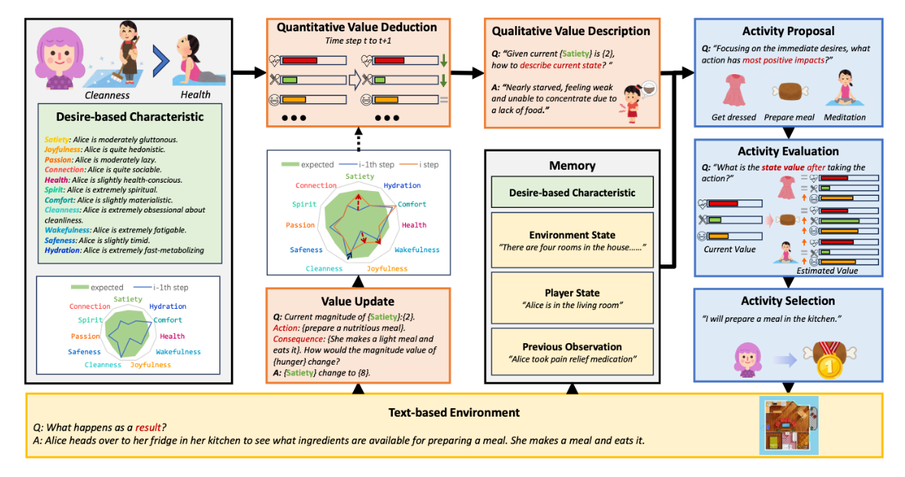

# D2A
**Simulating Human-like Daily Activities with Desire-driven Autonomy**

paper link:

## Abstract

Existing task-oriented AI agents often depend on explicit instructions or external rewards, limiting their ability to be driven by intrinsic motivations like humans. In this paper, we present a desire-driven autonomy framework to guide a Large Language Model based(LLM-based) agent to simulate human-like daily activities. In contrast to previous agents, our Desire-driven Autonomous Agent (D2A) operates on the principle of intrinsic desire, allowing it to propose and select tasks that fulfill its motivational framework autonomously. Inspired by the Theory of Needs, the motivational framework incorporates an understanding of human-like desires, such as the need for social interaction, personal fulfillment, and self-care. Utilizing a desire-driven task generation mechanism, the agent evaluates its current state and takes a sequence of activities aligned with its intrinsic motivations. Through simulations, we demonstrate that our Desire-driven Autonomous Agent (D2A) generates coherent, contextually relevant daily activities while exhibiting variability and adaptability similar to human behavior. A comparative analysis with other LLM-based frameworks demonstrates that our approach significantly enhances the rationality of the simulated activities

## Desire-driven Autonomous Agent Framework



## Environment


## Usage

The D2A environment is under the `examples/D2A` folder.

In D2A folder the file structure is:
```
examples/
├── D2A/
│   ├── Baseline_agent/
│   │   ├── BabyAGI_ActComp.py
│   │   ├── Baseline_BabyAGI.py
│   │   ├── Baseline_comp.py
│   │   ├── Baseline_LLMob.py
│   │   ├── Baseline_ReAct.py
│   │   ├── LLMob_ActComp.py
│   │   └── ReAct_ActComp.py
│   └── D2A_agent/
│       ├── Value_ActComp.py
│       └── ValueAgent.py
├── Environment_construction/
│   └── generate_indoor_situation.py
├── NPC_agent/
│   └── generic_support_agent.py
├── result_folder/
├── value_components/
│   ├── hardcoded_value_state.py
│   └── init_value_info_social.py
│
├── value_comp.py
├── __init__.py
├── experiment_setup_indoor.py
├── experiment_setup_outdoor.py
├── indoor_Room.py
├── NullObservation.py
└── outdoor_party.py
```

### Run the simulation:
1. Set up the **environment dependencies** by:
  ``
2. Set up the **experiment setting** in `experiment_setup_indoor.py` and `experiment_setup_outdoor.py`
   - ROOT (the root path of the project, the folder which has `concordia` and `examples` in it)
   - episode_length
   - disable_language_model
   - st_model
   - tested_agents
   - whether to use previous profile
     - Use_Previous_profile
     - previous_profile_file
     - previous_profile
     - previous_profile's path
   - Backbone LLM (details refers to concordia package)
     - api_type
     - model_name
     - api_key
   - desires-related stuff (the desire dimensions to be used while simulating)
     - visible_desires (will appear in the context as the hint for the agent)
     - hidden_desires (will not appear in the context as the hint for the agent)
   - the path to store the result

3. **run the simulation** by `python PATH/to/indoor_Room.py` or `python PATH/to/outdoor_party.py`

To modify desire-related components, navigate to the `value_components` folder and follow these steps across different files:
### value_comp.py
1. create the new desire component subclass in `value_comp.py`
### init_value_info_social.py
2. Modify the profile_dict by adding a new entry:
   ```python
    {"descriptive_adjective": "desire_name"}
   ```
3. Add the desire name to the `values_names` list
4. Add corresponding descriptions to `values_names_descriptions`
### hardcoded_value_state.py
1. Add numerical value mappings to `hardcore_state`. You can use GPT to design appropriate mapping scales.

### Optional: Enable LLM Value Conversion
To use LLM for action value conversion, goto `value_comp.py`
- replace `_convert_numeric_desire_to_qualitative_by_hard_coding(self)` function in the `_make_pre_act_value(self)` to `_convert_numeric_desire_to_qualitative(self)`.
